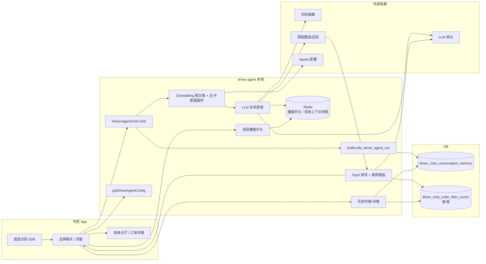
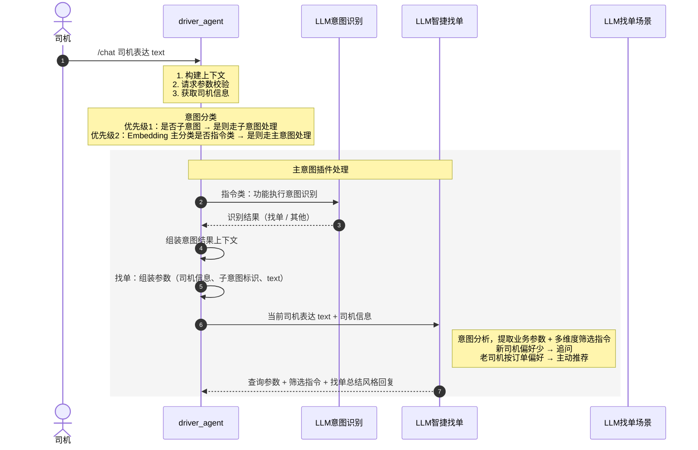
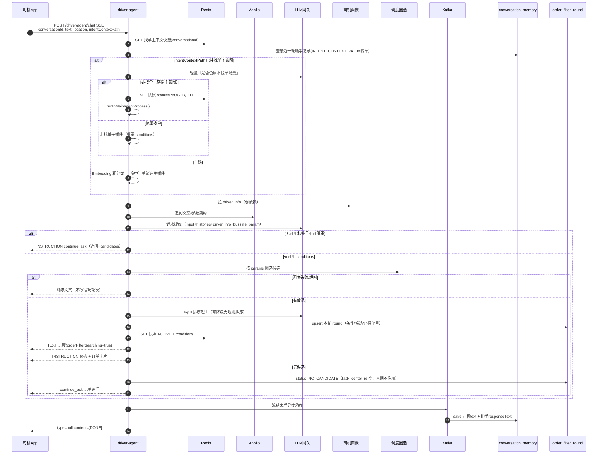

# 帮司机找单 Agent 技术方案

> 填写说明（评审人员请对照）：
> 1、涉及模版相关解释文字请勿删除，可提供评审人员参考方案是否完善
> 2、模版中示例说明可以直接修改/删除；
> 3、标注 ☆☆☆ 的章节为核心关注点，务必认真填写
> 4、方案不涉及的，要在模块名称上标注不涉及（如：数据库设计：不涉及）

---

## 1. 背景介绍

描述本次改造涉及的需求背景，或者技术改造解决的具体问题

**需求背景：**  
司机通过语音/文字唤醒 AI 助手时，核心诉求是「帮我找单」，但现网能力偏「指令跳页」：命中「订单筛选 / 附近 / 全国 / 顺路」后，主要是跳到抢单大厅对应 Tab，**不会在对话里完成条件澄清、候选召回、排序解释、换一批**。数据分析显示：

- 有效指令中「找单」占比最高，但约 **98.9% 找单请求不带筛选条件**（「来个单」「给我来个订单」），现网抽槽为空后只能跳页或冷启动附近 Tab，体验割裂。
- 找单一旦带条件，错误主要集中在 **地点（orderAddress）**。
- 会话中存在 **主意图穿插**（正在找单时突然问「为什么没单 / 查看本周收入 / 打电话」），现网子意图插件缺少「是否仍属本找单场景」判定，上下文易丢或串意图。

**本次要解决的问题：**

1. 把「找单」从跳页指令升级为 **对话内找单 Agent**：多轮诉求提取 → 调度圈选 → TopN 排序 + 推荐理由 → 端上展示/播报。
2. 补齐 **主/子意图分流、穿插打断、上下文挂起恢复**。
3. 补齐助手入口、欢迎页、历史会话、全屏语音播报开关等体验。
4. **本期不涉及**调度「找单任务中心」的注册/推送/终止（无单时只做到对话内追问 + 附近兜底，任务中心字段预留）。

| 类型 | 文档链接 |
| --- | --- |
| PMIS | **【待补：PMIS 链接】** |
| PRD | **【待补：PRD 链接】** |
| 方案 | 帮司机找单 Agent 整体方案 V1 |

---

## 2. 整体架构图

通过一张图粗粒度描述本次改造涉及到的域或者服务，以及当前域或者服务在这个链路中的定位

> 原飞书配图请保留。以下为评审可阅读的文字化架构（粒度到缓存/DB）。`driver-agent` 是本需求主域：承接端上对话、意图路由、找单编排；调度/画像/LLM 为下游。



**本域定位：** 对话编排中枢。不负责订单库存与大厅列表本身；负责把司机自然语言变成 **结构化筛单条件**，调用调度拿到候选，再把 **可解释的 TopN** 回给端。跳页类指令（听单筛选、全国 Tab 等）仍走原指令协议，与「对话内找单」分流。

---

## 3. 涉及服务

描述本次改动涉及到的变更系统以及上下游影响的系统

| 服务类型 | 服务说明（APPID） | 变更/依赖说明 | 跟进人员 | 方案文档 |
| --- | --- | --- | --- | --- |
| 自身服务 | driver-agent **【APPID 待补】** | 主改：chat SSE 找单主/子插件、诉求提取、轮次表、历史接口、配置、播报开关、上下文 Redis | 本需求研发 | 本文档 |
| 外部依赖 | 司机 App（Android/iOS） | 流式协议对齐、`intentContextPath` 挂载、历史入口、欢迎页/浮窗 tips、播报开关仅控制全屏 | 端上 | 端协议（见 5.对外协议） |
| 外部依赖 | LLM 网关 **【APPID 待补】** | 诉求提取、是否仍属找单场景、推荐理由；弱依赖需降级文案 | 算法/LLM | 提示词见 5.LLM |
| 外部依赖 | 调度圈选/召回 **【APPID 待补】** | `conditions.params` 对齐调度协议；冷启动附近 Tab 兜底；**本期不接任务中心** | 调度 | **【调度协议链接待补】** |
| 外部依赖 | 司机画像 **【APPID 待补】** | 新/老司机、车型/偏好，注入 `<driver_info>`；弱依赖，失败则当新司机追问 | 画像 | 见 5.司机画像 |
| 外部依赖 | Apollo | `driver.agent.high.version.listen.window.tips`、`instruct.list`、追问文案、灰度开关 | 本需求 | — |
| 外部依赖 | Kafka | 复用 `bfe_driver_agent_svc` 异步落会话 | 本需求 | — |

---

## 4. 用例分析

列举本次改动涉及的所有业务用例，写清楚改动涉及到的功能点即可

| 场景 | UI | 涉及接口 | 改动说明 |
| --- | --- | --- | --- |
| 高版本/实验组入口感知 | 浮窗 tips | `getDriverAgentConfig` | 按 App 版本 + 实验组读新 key：`driver.agent.high.version.listen.window.tips` |
| 欢迎页快捷指令 | 全屏欢迎页 | `getDriverAgentConfig` | 新会话读 `driver.agent.high.version.instruct.list`；旧会话按 `conversationId` 拉历史 + 找单轮次订单 |
| 全屏语音播报开关 | 全屏聊天框 | 播报开关读写接口 | 仅控制全屏 TTS，不影响浮窗；key=`driverId+conversationId`，value=0/1 |
| 首轮模糊找单 | 聊天 | `/driver/agent/chat` SSE | 「来个单」无可用标签：新司机追问澄清；老司机用画像填默认可筛条件后召回 |
| 首轮明确找单 | 聊天 | chat + 调度 | LLM 抽 `conditions` → 调度圈选 → TopN + 理由 → 写轮次表 |
| 多轮补条件/改条件 | 聊天（子意图） | chat | `intentContextPath` 挂找单子场景；继承上一轮 `conditions` 做增量覆盖 |
| 非首轮仍说模糊话术 | 聊天 | chat | **继承历史已确认条件再召回**，不回退附近冷启动（见 5.1 决策）；仅历史过期/被清空才附近兜底 |
| 换一批 | 聊天 | chat | 同 `conversationId` 读轮次表，排除 `recommended_order_nos` 再排 TopN |
| 无单 / 条件不足 | 聊天 | chat | `status=continue_ask`，返回 `candidates` 快捷项；**本期不注册任务中心** |
| 找单中穿插主意图 | 聊天 | chat | 子插件先判「是否仍属找单」→ 否：`runInMainIntentProcess()`；找单上下文 **暂停压栈**（Redis） |
| 「为什么没单」 | 聊天 | 少单检查插件 | 有接单阻塞 → 旧逻辑跳接单检测；无阻塞 → 走找单冷启动（附近兜底） |
| 明确跳页（听单筛选/顺路/播报/全国/附近 Tab） | 大厅 | 原页面跳转指令 | **仅明确「打开/跳转 xxx」才走跳页**，与对话内找单分流，语料不扩到「来个单」 |
| 查看订单详情 | 订单详情 | `d_a_f_060004` | 跳转详情；需支持返回助手（端上协议对齐） |
| 历史会话列表 | 更多-历史 | `GET /driver/agent/conversation/history/list` | 按会话聚合，today/thisMonth/earlier |
| 历史会话详情 | 历史详情 | `GET /driver/agent/conversation/history/detail` | 聊天记录 + 找单轮次推荐订单 |

---

## 5. 系统详细设计 ☆☆☆

系统交互图  
交互图用来说明本次需求涉及的上下游间调用关系。可用时序图或者泳道图画。  
**特别注意：流程图/交互图里的最小粒度要到缓存和DB层**

### 5.0 系统交互图（与飞书时序图对齐：主意图插件处理）

> 原飞书 UML 请保留。下图按该时序还原：**子意图优先于 Embedding 主分类**；主插件内先 LLM 意图识别，再 LLM 智捷找单。图中未画出调度/缓存/DB，补全见 5.0.1。



**读图要点（给评审）：**

1. **先子后主。** 有进行中的找单子意图时，不先做 Embedding 主分类，避免「杭州」被认成新的页面跳转。
2. **主插件是两段 LLM。** `LLM意图识别` 只判定「找单还是其他」；`LLM智捷找单` 才抽槽、出 summary / candidates / conditions。二者不要合成一次调用，否则指令类（打电话、跳页）会被找单提示词带偏。
3. **新老司机分叉在智捷找单内部**，不在意图识别阶段。无偏好 → 追问；有偏好 → 主动推荐。
4. **本图缺口（须看 5.0.1）：** 子意图插件内部「是否仍属找单」与 `runInMainIntentProcess()` 回跳；调度圈选；Redis 上下文暂停；round 表 / Kafka 落库。`LLM找单场景` 泳道在飞书图中已画出，主路径未连线，用于子意图场景判定，见路由章节。

### 5.0.1 补全交互图（缓存 / DB / 调度，模版要求粒度）



### 模块列表

| 模块 | 是否涉及 | 说明 |
| --- | --- | --- |
| 入口感知 / 欢迎页 / 播报开关 | 涉及 | 配置 + 端上协议 |
| 意图识别与路由（主/子/穿插） | 涉及 | 核心 |
| 多轮会话与上下文栈 | 涉及 | 核心 |
| LLM 诉求提取 | 涉及 | 核心 |
| 调度召回 + TopN | 涉及 | 依赖调度协议对齐 |
| 找单轮次表 / 历史会话 | 涉及 | 新增表 + 新接口 |
| 司机画像 | 涉及（弱依赖） | 新老司机默认条件 |
| 找单任务中心 | **不涉及（本期）** | 表字段预留 |
| 数据库设计 | 涉及 | 见第 6 章 |
| 消息设计 | 涉及 | 复用已有 Kafka |
| 缓存设计 | 涉及 | 播报开关 + 找单上下文 |
| 定时任务设计 | **不涉及** | 上下文用 Redis TTL + 懒过期 |

### 模块系分

分析该用例详细的修改点，描述本次需求涉及的所有变更

---

### 1. 诉求收集/分析（多轮会话 + LLM 诉求提取）

#### 多轮会话总览（端 ↔ 服务 ↔ LLM）

- **会话隔离：** `conversationId` 仍由端上生成。进行中会话沿用同一 ID；司机点「新对话」则新 ID。建议同一自然日内默认同会话，但以端上新建行为为准。
- **子意图挂载：** 请求 `intentContextPath` 非空表示端上认为仍在找单多轮；服务端以 Redis 快照 + 最新一轮 `extInfo.INTENT_CONTEXT_PATH` 为准做校验。
- **历史圈选（喂 LLM）：** 不要把整天聊天全塞进模型。只取：
  1. 最近一轮「找单子意图」助手消息中的 **summary + conditions**（已是多轮压缩结果）；
  2. 本轮用户 `text`；
  3. `driver_info`。
- **流式：** App 统一 `POST /driver/agent/chat`，`Content-Type: text/event-stream`。进度用 `type=TEXT`（`orderFilterSearching=true`），终态用 `type=INSTRUCTION`，结束 `[DONE]`。
- **落库时机：** SSE 正常结束后异步 Kafka 落两条 memory（司机 + 助手）；找单成功/无单在写 round 表之后。中途断开：已写出的 round 保留，memory 以是否收到终态为准，避免只落司机句不落助手句。

#### 意图指令协议变更

筛单相关的指令：

| 指令 | 是否已有 | 指令逻辑变更前 | 指令逻辑变更后 | 语料调整（调整前） | 语料调整（调整后） |
| --- | --- | --- | --- | --- | --- |
| 订单筛选【d_a_f_010004】 | 是 | 基于起终点等跳转特定页面（全国 Tab 等） | **按 App 新老版本分流**：老版本保持跳页；新版本/实验组走 **对话内找单主插件**（抽槽→调度→TopN）。明确「打开/跳转某 Tab」仍走下方跳页指令，不进找单 Agent | 找从 X 到 Y 的单；找到 Y 的单；帮我筛选订单 | 扩充模糊找单：来个牛逼大单、给我来个订单、帮我抢个订单、来个近一点的单等（以数据分析语料为准） |
| 查看订单【d_a_f_060004】 | 是 | 跳转订单详情页 | 跳转订单详情页；补充「从助手进详情后可返回助手」（端上） | — | — |
| 打开听单筛选【d_a_p_999999】 | 是 | 跳转听单筛选页 | 不变 | 打开/跳转听单筛选（明确跳页） | 保持「明确跳页」才命中，避免和「帮我筛单」抢路由 |
| 查看顺路订单 | 是 | 跳转抢单大厅顺路 Tab | 不变 | 打开/跳转顺路订单 | 明确跳页才命中 |
| 查看播报订单 | 是 | 跳转播报 Tab | 不变 | 打开/跳转播报订单 | 明确跳页才命中 |
| 查看全国订单 | 是 | 跳转全国 Tab | 不变 | 打开/跳转全国订单 | 明确跳页才命中 |
| 查看附近订单 | 是 | 跳转附近 Tab | 不变。**对话里说「来个附近的单」走找单 Agent**（抽 `pickup_distance`），不是本跳页指令 | 打开/跳转附近订单 | 明确跳页才命中 |

#### 功能点（入口 / 欢迎页 / 历史 / 开关）

| 功能点 | 页面示例 | 需求描述 | 需求备注 | 功能实现 |
| --- | --- | --- | --- | --- |
| 入口感知 | 原文档配图保留 | 浮窗唤醒文案随版本/实验组变化 | 仅高版本+实验组 | `getDriverAgentConfig` 增加 app 版本判断 & 实验组；新逻辑读 Apollo `driver.agent.high.version.listen.window.tips`，value 示例：`["帮我找单","来个近一点的单","去热力图","查看钱包","去加油","去充电"]` |
| 欢迎页优化 | 原文档配图保留 | 新会话展示快捷指令；旧会话恢复聊天+推荐订单 | 语音播报开关只控全屏 | 新会话读 `driver.agent.high.version.instruct.list`，示例 `["找单","推荐订单","去加油"]`；旧会话用 `conversationId` 拉 memory + round 表。播报开关：读写以 `driverId+conversationId` 为 key，value=0/1，存 Redis（见第 6 章），**协议待与端上终对齐** |
| 会话记录列表 | 原文档配图保留 | 更多-历史：今天/本月/更早 | 标题取司机第一条消息 | 见下方历史接口；只查 `BusinessLineEnum.ZB` + `ChatChannelEnum.AI_CUSTOMER` + `MessageType.USER` 且未删除 |

历史列表聚合规则（实现口径，避免测试理解分歧）：

- 按 `conversationId` 聚合。
- `title` = 该会话中 **司机第一条** USER 消息内容（截断策略与端上对齐，建议 30 字）。
- `lastActiveAt` = 该会话中 **司机最后一条** USER 消息时间（不用助手时间，避免系统追问把会话顶到今天）。
- 全局按 `lastActiveAt` 倒序后分桶，桶内仍倒序。
- 分桶（服务器当地自然日/月）：
  - today：`lastActiveAt >= 今日 00:00:00`
  - thisMonth：`本月 1 日 00:00:00 <= lastActiveAt < 今日 00:00:00`
  - earlier：`lastActiveAt < 本月 1 日 00:00:00`

---

### 意图识别 & 路由（核心）

**主路径（未挂子意图）：**  
浮窗唤醒 → 聊天 → Embedding 粗分类 → 功能执行 → 命中 **筛单主插件** → 找单：

1. LLM 标签/条件提取。
2. **无可用标签：** 进入调度 **冷启动**（附近 Tab 兜底召回）；同时按新老司机决定是否追问。
3. **有可用标签：** 调度正常圈选。
4. 候选 → TopN 排序 + 推荐理由 → 组装 SSE → 写 round 表。
5. 用请求里的 `conversationId` 判断是否已有找单历史：无 round / 无有效快照 = **首轮**，否则 **非首轮**。

**首轮 / 非首轮 × 有无标签（评审决策，补原草稿问号）：**

| | 提取到可用标签 | 未提取到可用标签（来个单 / 来个大单） |
| --- | --- | --- |
| **首轮** | 用本轮 `conditions` 召回 | **冷启动附近兜底** + 追问。新司机：固定画像不足以填最小可筛条件 → Apollo 文案「您需要什么条件的订单，拉妹可以帮你找哦~」。老司机：画像可转成合法 `params` → 先按画像召回，同时用 `candidates` 给收窄项 |
| **非首轮** | 与历史 `conditions` **增量合并**（本轮覆盖同 key）后召回 | **禁止再走附近冷启动**。继承上一轮已确认 `conditions` 再召回，文案：「已经按您之前的条件推荐，需要补充可以继续说」。若快照过期/PAUSED 已作废，则降级为与首轮相同 |

「来个大单」若业务参数表 **没有** 对应 `param_key`，不得臆造；放入 `remark` 与 `candidates`（如议价单/高价排序），`conditions` 保持可调度的合法键。小车可将 implicit「大」映射到 `sort_type=按价格` **仅当** 契约允许且在 `remark` 标注来源=推断，**默认不写入 params，除非产品确认「大单」可落排序**。【产品确认项】

**子路径（端上已带找单子意图）：**  
意图分类 → 子意图 → 筛单子插件：

1. **轻量规则前置 + LLM 兜底** 判断「是否仍属本找单场景」。规则优先命中：换一批、近一点、只要 4 米 2、不要拼车、从 A 到 B 等。LLM 只处理规则打不准的短句。
2. **命中非找单** → 找单快照 `PAUSED` → `runInMainIntentProcess()` 回主链：
   - 「为什么没单」→ 少单检查插件：有接单阻塞走旧接单检测；否则 **本期新**：找单冷启动。
   - 跳页/打电话/查收入/关助手等走原主意图。
   - 噪音 / 无响应类：**不打断、不压栈**。
3. **命中找单** → 与主插件同一套提取/召回/排序，输入带历史 `conditions`。

**主意图穿插时，被打断的子意图上下文（评审决策）：**

不是删掉，是 **暂停压栈**。

| 打断类型 | 上下文处理 | 恢复 |
| --- | --- | --- |
| 瞬时（刷新定位、截图） | Redis 快照保持 `ACTIVE` | 下一句直接接着填 |
| 可回来的主意图（查收入、跳页、为什么没单） | `status=PAUSED`，TTL=180s（Apollo） | 主意图终态后 **不主动追问**（开车防话痨）；下一句若仍属找单则恢复槽位，并短口头确认 summary |
| 互斥/结束（明确取消、新开对话、导航长任务） | 删除快照或标 `EXPIRED` | 不再继承 |
| 噪音 | 不改变快照 | — |

过期条件（任一命中则不可静默继承）：TTL 到期；`conversationId` 变更；定位城市与 `start_city` 冲突且司机未确认；司机说「重新找 / 不要刚才的条件」。

Redis 快照建议结构：

```json
{
  "conversationId": "20260427WMSX5893421",
  "status": "ACTIVE | PAUSED | EXPIRED",
  "intentContextPath": "FIND_ORDER",
  "summary": "整车找货，上海→杭州，今天装",
  "conditions": [],
  "lastRoundChatId": "20260427WMSX5893421#0003",
  "recommendedOrderNos": [],
  "pausedBy": "MAIN_INTENT:d_a_xxx",
  "updatedAt": 1783075422554
}
```

同会话 **只保留一份找单快照**，禁止叠两个订路线/两套找单条件。

---

### 请求 / 响应协议（chat SSE）

App 统一请求流式聊天接口 `/driver/agent/chat`（`Content-Type: text/event-stream`），待跟端上对齐。

**请求示例：**

```json
{
  "conversationId": "20260427WMSX5893421",
  "currentCityId": 1154,
  "currentPage": "HallPage_1",
  "hasOrderDetail": false,
  "intentContextPath": "",
  "location": {
    "latitude": 35.093131,
    "longitude": 117.073257
  },
  "messageId": "20260427WMSX5893421#0001",
  "orderDetectParams": {
    "locationPermissionStatus": 1,
    "networkStatus": 1,
    "orderFloatingWindowStatus": 1,
    "tabTypeList": [1, 5, 2, 101, 4]
  },
  "text": "来个附近的单"
}
```

**公共响应外壳：**

```json
{
  "content": "string 或 嵌套 JSON 字符串，见下",
  "error": { "code": "string", "msg": "string" },
  "type": "TEXT | INSTRUCTION | null"
}
```

**无单追问终态：**

```json
{
  "type": "INSTRUCTION",
  "error": null,
  "content": {
    "intentCommand": null,
    "responseText": "需要确认一下车型。\n\n筛单总结：意图待明确\n\n候选追问：\n\n    1、4米2厢车\n\n    2、6米8高栏\n\n",
    "remark": "{\"status\":\"continue_ask\",\"responseText\":\"需要确认一下车型。\",\"summary\":\"意图待明确\",\"candidates\":[\"4米2厢车\",\"6米8高栏\"],\"conditions\":[],\"orderFilterItems\":[],\"remark\":\"step1 内部备注\",\"orderFilterSearching\":null,\"intentContextPath\":null}",
    "generatedByAI": false,
    "intentErrorCode": null,
    "continueRecognize": false,
    "intentContextPath": "xxxx",
    "actionButtons": null
  }
}
```

**进度 + 找单终态 + 结束帧：** 进度 `type=TEXT` 且 `orderFilterSearching=true`；终态 `type=INSTRUCTION` 带 `orderFilterItems`；结束 `type=null, content="[DONE]"`。终态需回写 `intentContextPath`（如 `FIND_NEARBY_ORDER` / `FIND_ORDER`）供端上挂子意图。`generatedByAI=false` 表示业务模板/编排结果，不是闲聊生成。

协议字段以端上联调终版为准；变更走「协议变更确认 SOP」。

---

### 会话记录保存

接口流式响应结束后异步落库：

1. 发送 Kafka（topic：`bfe_driver_agent_svc`）。
2. `IntentRecognizeResultMessageConsumer` 消费后 `saveConversationRecord`，`DriverChatConversationMemoryRepository.save` 写入两条：
   - 司机：本轮 `text`
   - 助手：`message.getResponseText()`（`buildMessage` 优先 `context.getResponseText()`，否则 `DriverIntentRecognizeVO` 文本）
3. 找单轮次另写入 `driver_chat_order_filter_round`（会话 ID、chatId、召回、排序结果等），供「换一批」与历史详情。幂等键：`uk_driver_chat(driver_id, chat_id)`。

DDL 见第 6 章（已修正原草稿注释未闭合问题，并补 `PAUSED` 不用落库、过期靠 Redis）。

**喂 LLM 的历史拼装：**  
`司机：… / 助手：…` 放入 `<chat_histories>`。找单上下文以最新一条 `extInfo.INTENT_CONTEXT_PATH` 为找单子意图的助手消息为准（带 summary）。

---

### 历史列表 / 详情接口

`GET /driver/agent/conversation/history/list?token=...&app=android`

```json
{
  "ret": 0,
  "msg": "success",
  "data": {
    "today": [
      {
        "conversationId": "conv_001",
        "title": "找一下从上海到北京的单",
        "lastActiveAt": "2026-05-13 16:09:28"
      }
    ],
    "thisMonth": [
      {
        "conversationId": "conv_003",
        "title": "怎么提高接单率",
        "lastActiveAt": "2026-05-11 16:09:28"
      }
    ],
    "earlier": [
      {
        "conversationId": "conv_005",
        "title": "咨询活动规则",
        "lastActiveAt": "2026-04-17 16:09:14"
      }
    ]
  }
}
```

`GET /driver/agent/conversation/history/detail?token=...&app=android&conversationId=2026041787316413329`

基础为问答对；**找单轮次需附加订单卡片**（原示例未含订单，联调需补字段，建议）：

```json
{
  "ret": 0,
  "msg": "success",
  "data": [
    {
      "conversationId": "2026041787316413329",
      "chatId": "2026041787316413329#3354",
      "question": "来个上海到杭州的单",
      "answer": "开始执行筛单\n筛单总结：整车找货，上海到杭州，今天装",
      "timeStr": "2026-04-17 16:09:14",
      "orderFilterItems": []
    }
  ]
}
```

`orderFilterItems` 从 round 表按 `chat_id` 关联；非找单轮次该字段为空或不返回。

---

### LLM 诉求提取

**目标：** 多轮从语音/文本提取结构化 `conditions` + `summary` + `candidates`，供调度使用。

**输入：**

| 变量 | 标签 | 来源 |
| --- | --- | --- |
| `{{input}}` | `<user_input>` | 本轮 text |
| `{{histories}}` | `<chat_histories>` | 最近一轮找单压缩历史（summary+conditions），不是全量聊天 |
| `{{driverInfo}}` | `<driver_info>` | 本期所需画像；失败则空 |
| `{{paramList}}` | `<bussine_param>` | 业务参数宽表，硬约束 |

**输出 JSON Schema（保持原契约，禁止增删必填字段）：**

- 必填：`responseText`, `summary`, `candidates`, `conditions`, `remark`
- `conditions`：最多 1 个元素；`business_line` 只能来自司机信息 ∈ {小车, 大车, 跑腿}，**用户话术不能覆盖业务线**
- `params` 的 key 必须是契约 `param_key`；`filter` 必须是枚举值；`preference_switch` 仅为开/关
- `params` 只收：司机已表达 / 已点选 / 已口述确认 / **可来自档案且在 remark 标注来源**
- `candidates`：最多 3～4 条，与当前条件不重复，多样性优先；**允许产品改为 Apollo 配置、不走 LLM**
- `responseText` 与 `summary` 口径一致、风格可不同；`remark` 不展示给司机

业务参数主表、`filter` 可选值：**沿用需求稿宽表（小车/大车/跑腿），本文不删**，作为评审对照 LLM 是否越权抽槽。实现时将该表注入 `<bussine_param>`。调度入参映射表需与调度 **字段级对齐**【阻塞项】。

**模型选型：** 待后期比对能力与耗时。诉求提取与「是否仍属找单」可拆小模型；推荐理由可用同模型或规则降级。

**异常：** LLM 超时/非 JSON/非法 param_key → 丢弃非法键，保留合法键；若合法键为空则走「无可用标签」分支；对司机固定降级文案，打点 `llm_extract_fail`。

---

### 2. 司机画像

1. **依赖：** 司机画像服务（弱依赖）。超时/失败：按 **新司机** 处理（追问，不写推断 params）。
2. **特征（本期最小集，可按画像字段再对齐）：**
   - 新/老司机（是否有成交/有效完单）
   - 业务线（小车/大车/跑腿）
   - 常跑线路、常驻城市、车型/车长、听单偏好开关
3. **使用边界：** 画像只能进 `params` 当「档案推断」且 `remark` 标明；**不得覆盖**司机本轮明确否定的条件。老司机首轮模糊找单：用画像填 **最小可召回集**，同时 `candidates` 给「换线路/改距离」避免 silently 锁死。

---

### 对外接口设计

需要同步更新对外能力文档

- 众包履约能力（迭代中）
- 履约平台能力（迭代中）

**本需求对外接口：**

| 接口 | 新/改 | 说明 |
| --- | --- | --- |
| `getDriverAgentConfig` | 改 | 版本+实验组+新 Apollo key |
| `POST /driver/agent/chat` | 改 | 新老版本订单筛选指令分流；SSE 内容扩展找单卡片/追问 |
| `GET /driver/agent/conversation/history/list` | 新 | 历史列表 |
| `GET /driver/agent/conversation/history/detail` | 新 | 历史详情+订单 |
| 语音播报开关 GET/SET | 新 | 协议待对齐 |

### 对外协议文档

补充跟技术方案相关接口文档地址信息，可以提供 ldoc，swagger，接口协议文档中的任意一种

- chat / 历史 / 开关：**【ldoc 待补，联调前必须有】**
- 调度圈选：**【待补】**
- 画像：**【待补】**

### 协议变更说明

变更必须涉及产研、测试确认后方可进入开发，信息不全禁止变更协议。协议变更确认 SOP

**本需求协议变更清单：**

| 协议 | 变更点 | 调用方 | 是否减少字段 | 确认人 | 状态 |
| --- | --- | --- | --- | --- | --- |
| `/driver/agent/chat` 请求 | `intentContextPath` 语义扩展为找单子意图 | App | 否 | 产研测 | 待确认 |
| `/driver/agent/chat` 响应 | `remark` 内找单结构、`orderFilterItems`、`orderFilterSearching` | App | 否 | 产研测 | 待确认 |
| `getDriverAgentConfig` | 新 tips / instruct 列表 | App | 否 | 产研测 | 待确认 |
| 历史 list/detail | 新增 | App | — | 产研测 | 待确认 |
| 播报开关 | 新增 | App | — | 产研测 | 待对齐 |
| 调度圈选入参 | `conditions.params` → 调度字段 | 调度 | 否 | 调度+研发 | **阻塞** |

---

## 6. 中间件设计

数据一致性 & 幂等性设计，涉及消息消费、状态机变更、并发控制等场景时必填（规范参考：开发规范）

**一致性与幂等：**

- 同一 `messageId`/`chat_id` 重复到达：round 表 `uk_driver_chat` 保证一轮一单；memory 消费需按 `chat_id+role` 幂等（已有则跳过）。
- SSE 先回端、再异步落库：允许端上已展示但 DB 延迟；历史查询以 DB 为准。失败重试 Kafka，禁止因落库失败阻断找单响应。
- 换一批与写入 round 并发：按 `conversation_id` 维度串行（Redis lock，TTL 3s），避免两次换一批读到同一批 `recommended_order_nos`。

### 数据库设计

涉及 DB

**订单库 / 会话库：** 新增找单轮次表；会话仍用 `driver_chat_conversation_memory`（无表结构变更则不发 DML）。历史数据：无存量 round，列表/详情订单区为空即可。归档：随会话库现网归档策略，**本期不单独归档任务**。

```sql
CREATE TABLE `driver_chat_order_filter_round` (
  `id`                     bigint(20)  NOT NULL AUTO_INCREMENT COMMENT '主键',
  `driver_id`              bigint(20)  NOT NULL COMMENT '司机ID',
  `business_line`          varchar(20) NOT NULL DEFAULT 'ZB' COMMENT '业务线,ZB众包、SDP专送',
  `channel`                varchar(20) NOT NULL COMMENT '会话所属来源渠道（AI_CUSTOMER：AI客服）',
  `conversation_id`        varchar(50) NOT NULL COMMENT '会话ID',
  `chat_id`                varchar(50) NOT NULL COMMENT '生成候选的聊天ID（与 round 1:1）',
  `trace_id`               varchar(100)         DEFAULT '' COMMENT '链路追踪ID',
  `summary`                varchar(500)         DEFAULT '' COMMENT '本轮找单一句话总结',
  `conditions`             text                 COMMENT '已确认筛选条件 JSON（OrderCondition 列表）',
  `candidates_order`       text                 COMMENT '候选订单 JSON 列表',
  `recommended_order_nos`  text                 COMMENT '已推送给司机的订单 JSON 列表',
  `status`                 varchar(20) NOT NULL DEFAULT 'SEARCHED' COMMENT 'SEARCHED已出候选/NO_CANDIDATE无单/FAILED失败',
  `task_center_id`         varchar(64)          DEFAULT '' COMMENT '预留：无单注册任务中心ID，本期不写',
  `is_deleted`             varchar(2)           DEFAULT 'N' COMMENT '是否删除，Y：删除，N：未删除',
  `updated_at`             datetime    NOT NULL DEFAULT CURRENT_TIMESTAMP ON UPDATE CURRENT_TIMESTAMP COMMENT '更新时间',
  `created_at`             datetime    NOT NULL DEFAULT CURRENT_TIMESTAMP COMMENT '记录创建时间',
  PRIMARY KEY (`id`),
  UNIQUE KEY `uk_driver_chat`         (`driver_id`,`chat_id`),
  KEY       `ix_driver_conversation`  (`driver_id`,`conversation_id`),
  KEY       `ix_driver_status`        (`driver_id`,`status`,`updated_at`),
  KEY       `ix_task_center_id`       (`task_center_id`),
  KEY       `ix_created_at`           (`created_at`),
  KEY       `ix_updated_at`           (`updated_at`)
) ENGINE = InnoDB DEFAULT CHARSET = utf8mb4 COMMENT = '司机找单轮次记录';
```

评审注意：`candidates_order` / `recommended_order_nos` 为 text JSON，需评估单轮订单体积（建议单卡字段裁剪后入库，原始大报文不进表）。暂不分表，按 `driver_id` 查询；量级上来后再按 driver 哈希分表。

### 消息设计

涉及 Kafka

- Topic：`bfe_driver_agent_svc`（复用）
- 生产：chat 流结束
- 消费：`IntentRecognizeResultMessageConsumer` → memory
- 失败：重试 + 死信按现网规范；监控消费延迟
- 不新增状态机 Topic

### 缓存设计

涉及 Redis、本地缓存

| Key | 结构 | TTL | 用途 |
| --- | --- | --- | --- |
| `drv:agent:tts:{driverId}:{conversationId}` | 0/1 | 7d 或会话结束删除 | 全屏播报开关 |
| `drv:agent:findorder:{driverId}:{conversationId}` | JSON 快照 | 180s 可配 | 找单上下文 ACTIVE/PAUSED |
| `drv:agent:findorder:lock:{driverId}:{conversationId}` | lock | 3s | 换一批/写入互斥 |

禁止把整轮候选大 JSON 放 Redis（大 key）；候选以 DB round 为准。本地缓存：仅 Apollo 参数契约/文案。

### 定时任务设计：不涉及

上下文过期用 Redis TTL + 下次请求懒校验；本期无任务中心扫描 Job。

---

## 7. 稳定性分析 ☆☆☆

### 系统性能分析

- 新增接口或核心链路变更时必填（自身服务的压测报告同步更新文档 → 7、业务压测）
- 下游接口需要下游提供压测报告
- 中间件性能报告（SQL explain 等）

**链路耗时拆解（目标，压测后回填实测）：**

| 步骤 | 预估 | 失败策略 |
| --- | --- | --- |
| Embedding 粗分类 | 现网基线 | 失败走主链兜底/不响应噪音策略 |
| 是否仍属找单 LLM | +100～300ms | 规则命中则跳过 LLM；LLM 失败默认 **仍属找单**（少误打断）或规则-only【需压测后定】 |
| 诉求提取 LLM | +300～800ms | 降级无标签分支 |
| 画像 | +50～150ms | 空画像 |
| 调度圈选 | 下游基线 | 降级文案，不假推荐 |
| 推荐理由 LLM | +200～500ms | 规则理由/空理由仍出单 |
| 写 Redis/DB/Kafka | <50ms | 找单结果已返回则异步重试 |

SSE 先推「正在根据您的条件筛选订单」降低体感等待。  
**QPS：** 按浮窗唤醒 UV × 找单渗透估**【待产品给日均唤醒/找单次数】**；历史 list 低频。  
SQL：`ix_driver_conversation` 覆盖详情；list 需按 driver 查 memory 再聚合，评估现网单司机会话量，必要时加「最近 N 天」限制（建议 90 天）。  
压测报告：**发布前补** driver-agent 新链路、调度圈选、LLM 网关。

### 灰度及兼容方案分析

发布过程的灰度以及切流方案；灰度过程中接口、缓存、DB 数据的兼容性分析

- **入口灰度：** App 版本号 + 实验组；未命中走 **旧订单筛选跳页**。
- **服务端开关：** Apollo `find_order_agent.enable`，可按 driverId 尾号切流。
- **兼容：**
  - 老 App 不认识 `orderFilterItems`：仅用 `responseText`，或仍走跳页（按版本分流）。
  - 新表无数据不影响旧会话 memory。
  - Redis 快照可丢，降级为「无历史条件」。
- **回切：** 关实验组 + 关 Apollo，指令回跳页；新表保留不删。

### 监控告警分析

需要新增加的监控指标以及告警人员，修改已有的监控指标以及告警规则变更（履约平台大盘集合）

1. **【存量验证】** 是否具备验证存量功能无影响的核心指标（新老链路对比）  
   - 旧指令跳页成功率、RT、意图识别正确率（主意图 正确/失败，对比现网 93.97% 基线）  
   - 听单筛选/全国/附近 **跳页指令** QPS 与成功率，防止「来个单」误伤跳页
2. **【新功能验证】** 是否具备验证新功能正常的监控指标（成功率、耗时、命中率等）  
   - 找单主/子插件命中量、抽槽非空率、调度有单率、TopN 返回率  
   - LLM 提取成功率、JSON 合法率、非法 param 丢弃率  
   - 子场景「仍属找单」命中率、回主链率、误打断率  
   - chat SSE 成功率、分步耗时（提取/调度/排序）
3. **【异常场景】** 是否覆盖已知异常场景的监控或核对手段  
   - 调度超时、LLM 超时、画像失败、Kafka 堆积、round 写入失败、Redis 锁超时  
   - 无单率突增、附近兜底占比突增（可能提取全挂）
4. **【埋点覆盖】** 是否确认业务埋点完整性及对数据大盘的影响（参考规范众包履约 Exemplar 接入规范 v1.0）  
   - 端：唤醒、发送找单、点击订单、换一批、点 candidates、进详情、返回助手、播报开关  
   - 服务：intent、has_conditions、inherited_conditions、paused、cold_start

告警接收人：**【待补 oncall】**。核心：成功率下降、RT P99、无单率、LLM 失败率。

### 应急方案分析

发布阶段应急方案，如回滚、切流等；线上故障应急方案，如业务预案等

- 发布：实验组 1% → 10% → 50% → 全量；每档看无单率、误跳页、投诉。
- 回滚：关 Apollo + 实验组回滚；不回滚 DB 表。
- 调度故障：只追问不推荐，禁用冷启动刷附近（防脏列表）。
- LLM 故障：规则抽槽（起终点正则）+ 跳页兜底。
- 误推荐（条件抽错城市）：应急文案开关 + 强制跳大厅。

---

## 8. 舆情风险评估与预案

### 舆情风险点

是否涉及舆情风险，涉及需要接入舆情防控平台，协同产品进行舆情规则梳理，风险防控 货运司机舆情守护

**涉及。** 找单直接关系抢单利益：

- 抽错地点/条件导致「有单说没单」或推荐无关单
- 老司机被画像静默锁死线路
- 换一批重复单、漏单
- 语音误唤醒在找单会话里串单

需与产品梳理舆情规则，评估是否接入货运司机舆情守护。**推荐理由、summary 禁止承诺必有单、禁止诱导加价话术。** LLM `responseText` 过安全词表。

### 应急预案

描述舆情事件出现时的详细应急预案

1. 关找单 Agent 开关，回跳页。
2. 单司机维度黑名单跳过 Agent。
3. 客服口径：助手推荐仅供参考，大厅列表为准。
4. 保留 traceId、round.conditions、推荐单号，供投诉核对。

---

## 9. 评审结果

### 必检项目

| 检查内容 | 检查条件 | 检查项目 | 是否已检查（是、不涉及） |
| --- | --- | --- | --- |
| 是否有舆情风险 | 检查是否影响司机利益/抢单做单体验；如可能引起舆情，检查是否有准备应急预案 | 找单推荐影响抢单；已写开关回切+客服口径 | 是（预案需产品共建） |
| 新增接口 | 已有链路里新增接口 | 历史 list/detail、播报开关；chat 为变更非全新 | 是 |
| 新接口对原接口的 RT | chat 增加 LLM+调度，需压测 | 见第 7 章 | 是（压测报告待补） |
| 是否强依赖？弱依赖如何降级？是否可异步？ | 调度/LLM 对出单为强依赖但可降级文案；画像弱依赖；Kafka 异步 | 是 | 是 |
| 完全新增接口 | 该接口是否核心？非核心必须可降级 | 历史/开关非核心，失败不影响找单 | 是 |
| 接口 QPS 评估 | 待产品补唤醒量后回填 | 待补 | 否（待数字） |
| 接口变更 | 变更点是否通知所有调用方、是否减少字段 | 仅 App；不减字段 | 是（待协议会签） |
| redis 使用 | 是否只作缓存、是否有热点/大 key | 上下文小 JSON；开关小 key；候选不进 Redis | 是 |
| DB 表变更 | 新增表是否分表、索引是否合理 | 暂不分表；uk+会话索引 | 是 |
| 动态配置 | 文案、tips、TTL、enable、candidates | Apollo | 是 |
| 应急开关 | 新老指令回切、禁用推荐 | `find_order_agent.enable` | 是 |
| 异常补偿机制 | Kafka 重试；round 与 memory 允许短暂不一致 | 是 | 是 |
| 发布上线 | 灰度策略 | 版本+实验组+尾号 | 是 |
| 安全检查 | 权限变更/接口鉴权、数据脱敏、敏感信息加密 | token 鉴权同现网；订单/定位按现网脱敏；prompt 不落明文手机号 | 是 |
| 回滚验证检查 | 回滚方案是否经过验证 | 关开关即可；**发布前在预发演练一次回切** | 否（待演练） |

### 评审记录

| 项 | 内容 |
| --- | --- |
| 评审日期 | |
| 评审人员 | |
| 评审结果 | 通过 / 有条件通过 / 不通过 |
| 改进事项 | 见下方待办 |

**建议有条件通过前必须闭合：**

1. PMIS/PRD/APPID/调度协议/画像协议/ldoc 链接  
2. 「大单」能否落入 `sort_type` 或其它合法键（产品）  
3. 播报开关接口路径与读写语义  
4. 历史 detail 订单字段与端上卡片协议  
5. 调度入参映射表  
6. 压测报告与 QPS  
7. 是否接入舆情守护平台  
8. 「是否仍属找单」LLM 失败默认倾向（少打断 vs 少串单）
